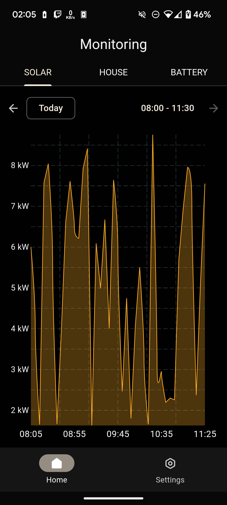
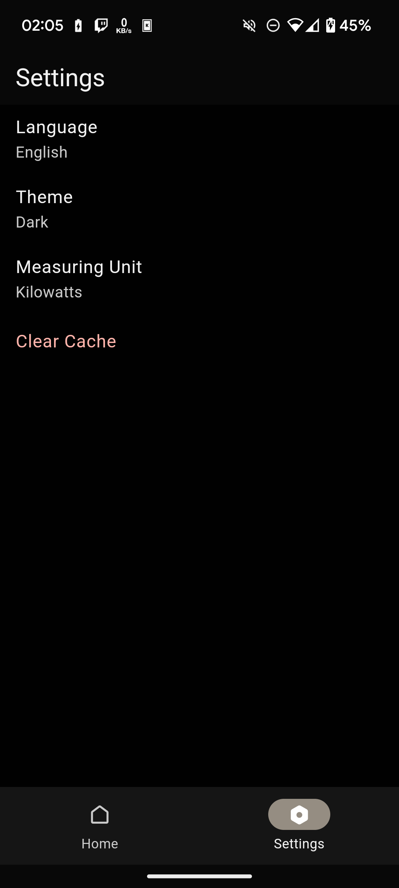
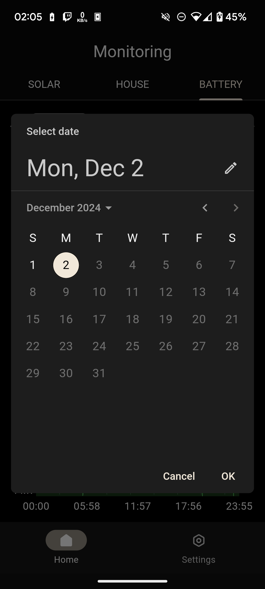
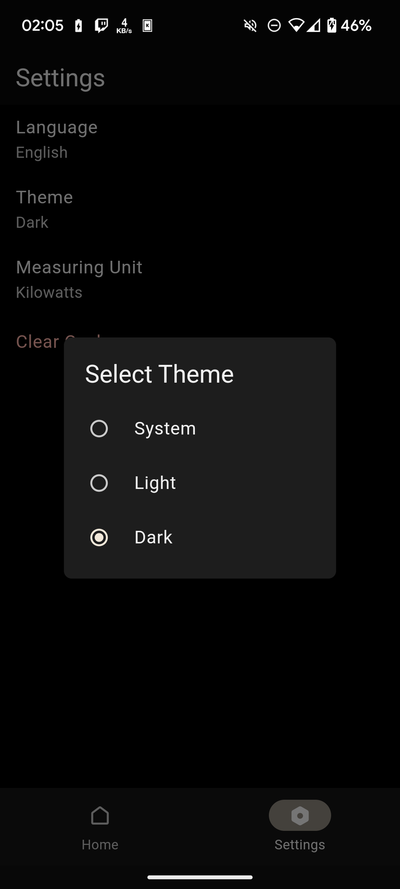
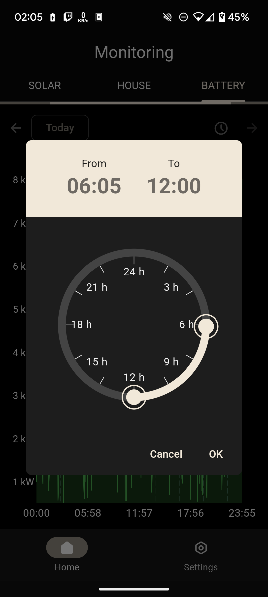
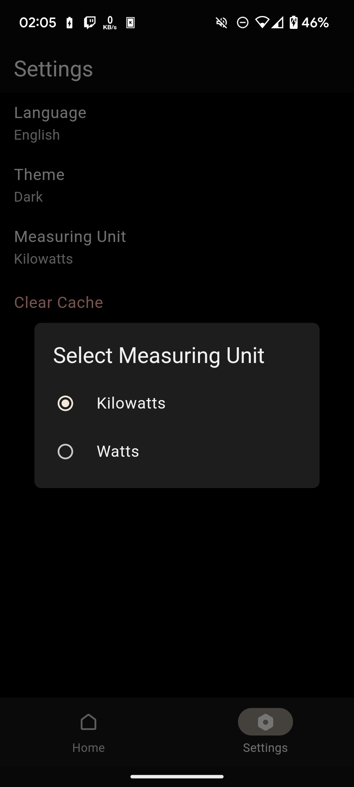

# Solar Monitor

A Flutter mobile application for monitoring and analyzing solar power systems in real-time. The app displays energy data through interactive charts and graphs, allowing users to track solar generation, household consumption, and battery usage patterns.

## Demo

| Monitoring & Analysis                 | Settings & Customization                |
| ------------------------------------- | --------------------------------------- |
|    |          |
|  |  |
|  |    |

Video Demo: [URL](http://google.com)

---

## Features

### Monitoring

- **Visualization**
  - Interactive line charts displaying solar generation, consumption, and battery levels
  - Auto-refresh every 5 seconds for real-time data (when viewing current day)
  - Pull-to-refresh functionality for manual updates

### Data Analysis

- **Filtering**

  - By date
  - By time range

- **Theming**
  - Dark and light theme options
  - System theme integration

### Technical Features

- Offline support with data caching
- Automatic connectivity monitoring

- Comprehensive error handling
- User-friendly error messages

- **Localization**
  - English language support
  - Expandable localization framework

## Architecture Overview

The application follows a clean, layered architecture consisting of four distinct layers:

1. **Data Layer**

   - Handles raw data storage and retrieval
   - Manages database operations and data models
   - Provides data persistence mechanisms

2. **Repository Layer**

   - Acts as a data abstraction layer
   - Implements data access patterns
   - Provides a clean API for the business layer

3. **Business Logic Layer**

   - Contains core business rules and logic
   - Processes and transforms data
   - Implements domain-specific operations

4. **Presentation Layer**
   - Manages user interface and interactions
   - Handles data presentation and formatting
   - Communicates with the business layer

Each layer maintains strict boundaries and follows the Single Responsibility Principle, ensuring a maintainable and scalable architecture.

## Project Structure

```
lib/
├── monitoring/
│   ├── bloc/
│   │   ├── monitoring_bloc.dart
│   │   ├── monitoring_event.dart
│   │   └── monitoring_state.dart
│   └── view/
│       ├── monitoring_page.dart
│       └── view.dart
│
packages/
├── monitoring_repository/
│   ├── lib/
│   │   ├── src/
│   │   │   ├── models/
│   │   │   │   ├── models.dart
│   │   │   │   └── monitoring_data.dart
│   │   │   └── monitoring_repository.dart
│   │   └── monitoring_repository.dart
│   └── test/
│       ├── models/
│       │   └── monitoring_data_test.dart
│       └── monitoring_repository_test.dart
│
├── solar_monitor_api/
│   ├── lib/
│   │   ├── src/
│   │   │   └── solar_monitor_api.dart
│   │   └── solar_monitor_api.dart
│   └── test/
│       └── solar_monitor_api_test.dart
│
test/
└── monitoring/
    ├── bloc/
    │   ├── monitoring_bloc_test.dart
    │   ├── monitoring_event_test.dart
    │   └── monitoring_state_test.dart
    └── view/
        └── monitoring_page_test.dart
```

## Getting Started 🚀

To update the base URL for the API, you can set the `SOLAR_API_BASE_URL` using the `--dart-define` flag, update the value in the `.vscode/launch.json` file

```json
 {
      "name": "Launch development",
      "request": "launch",
      "type": "dart",
      "program": "lib/main_development.dart",
      "args": [
        "--flavor",
        "development",
        "--target",
        "lib/main_development.dart",
        "--dart-define",
        "SOLAR_API_BASE_URL=http://localhost:3000"
      ]
    },
```

or update the default value in `lib/constants.dart`

This project contains 3 flavors:

- development
- staging
- production

To run the desired flavor either use the launch configuration in VSCode/Android Studio or use the following commands:

```sh
# Development
$ flutter run --flavor development --target lib/main_development.dart

# Staging
$ flutter run --flavor staging --target lib/main_staging.dart

# Production
$ flutter run --flavor production --target lib/main_production.dart
```

---

## Generate the API Client

This project uses the OpenAPI Generator to create type-safe API clients from OpenAPI/Swagger specifications.

### Configuration

Set your OpenAPI specification URL in `lib/api_gen.dart`

### Generation Commands

Generate the API client with:

```sh
# Generate API client code
$ dart run build_runner build --delete-conflicting-outputs
```

This will:

- Create API client classes based on your OpenAPI spec
- Generate request/response models
- Create type-safe methods for all endpoints

> **Note**: Run this command whenever your API specification changes to keep your client code in sync.

## Running Tests 🧪

To run all unit and widget tests use the following command:

```sh
$ flutter test --coverage --test-randomize-ordering-seed random
```

To view the generated coverage report you can use [lcov](https://github.com/linux-test-project/lcov).

```sh
# Generate Coverage Report
$ genhtml coverage/lcov.info -o coverage/

# Open Coverage Report
$ open coverage/index.html
```

---

## Working with Translations 🌐

This project relies on [flutter_localizations][flutter_localizations_link] and follows the [official internationalization guide for Flutter][internationalization_link].

### Adding Strings

1. To add a new localizable string, open the `app_en.arb` file at `lib/l10n/arb/app_en.arb`.

```arb
{
    "@@locale": "en",
    "counterAppBarTitle": "Counter",
    "@counterAppBarTitle": {
        "description": "Text shown in the AppBar of the Counter Page"
    }
}
```

2. Then add a new key/value and description

```arb
{
    "@@locale": "en",
    "counterAppBarTitle": "Counter",
    "@counterAppBarTitle": {
        "description": "Text shown in the AppBar of the Counter Page"
    },
    "helloWorld": "Hello World",
    "@helloWorld": {
        "description": "Hello World Text"
    }
}
```

3. Use the new string

```dart
import 'package:solar_monitor/l10n/l10n.dart';

@override
Widget build(BuildContext context) {
  final l10n = context.l10n;
  return Text(l10n.helloWorld);
}
```

### Adding Supported Locales

Update the `CFBundleLocalizations` array in the `Info.plist` at `ios/Runner/Info.plist` to include the new locale.

```xml
    ...

    <key>CFBundleLocalizations</key>
	<array>
		<string>en</string>
	</array>

    ...
```

### Adding Translations

1. For each supported locale, add a new ARB file in `lib/l10n/arb`.

```
├── l10n
│   ├── arb
│   │   └── app_en.arb
```

2. Add the translated strings to each `.arb` file:

`app_en.arb`

```arb
{
    "@@locale": "en",
    "counterAppBarTitle": "Counter",
    "@counterAppBarTitle": {
        "description": "Text shown in the AppBar of the Counter Page"
    }
}
```

### Generating Translations

To use the latest translations changes, you will need to generate them:

1. Generate localizations for the current project:

```sh
flutter gen-l10n --arb-dir="lib/l10n/arb"
```

Alternatively, run `flutter run` and code generation will take place automatically.

## Dependencies

| Package           | Description                                               |
| ----------------- | --------------------------------------------------------- |
| bloc              | State management solution implementing the BLoC pattern   |
| flutter_bloc      | Flutter widgets for integrating with bloc                 |
| go_router         | Declarative routing package for navigation                |
| fl_chart          | Feature-rich Flutter chart library for data visualization |
| get_it            | Service locator for dependency injection                  |
| injectable        | Code generator for get_it dependency injection            |
| hydrated_bloc     | Bloc extension for persisting and restoring state         |
| freezed           | Code generation for immutable classes                     |
| connectivity_plus | Cross-platform network connectivity monitoring            |
| flex_color_scheme | Material Design color system implementation               |
| formz             | Form validation made easy                                 |
| gap               | Flutter widget for adding gaps in layouts                 |
| intl              | Internationalization and localization support             |
| path_provider     | Platform-specific location access for storing files       |

### Development Dependencies

| Package              | Description                                       |
| -------------------- | ------------------------------------------------- |
| bloc_test            | Testing utilities for bloc                        |
| build_runner         | Code generation tool                              |
| very_good_analysis   | Strict Dart linting rules                         |
| mocktail             | Mocking library for testing                       |
| injectable_generator | Code generator for dependency injection           |
| freezed              | Code generator for data classes                   |
| json_serializable    | JSON serialization/deserialization code generator |

### Note:

- I have added an `@ApiOkResponse` decorator to the `getMonitoringData` endpoint in the solar-monitor-api project to ensure the OpenAPI generator creates the correct models.

```typescript
  @ApiOkResponse({
    description: 'Aggregated monitoring data for the given date and type',
    type: MonitoringDataDto,
    isArray: true,
  })
  async getMonitoringData(
    @Query('date') date: string,
    @Query('type') type: string,
  ): Promise<MonitoringDataDto[]> {
    if (!date || !type) {
      throw new Error('Date and type query parameters are required.');
    }
    return this.monitoringService.getAggregatedData(date, type);
  }
```
